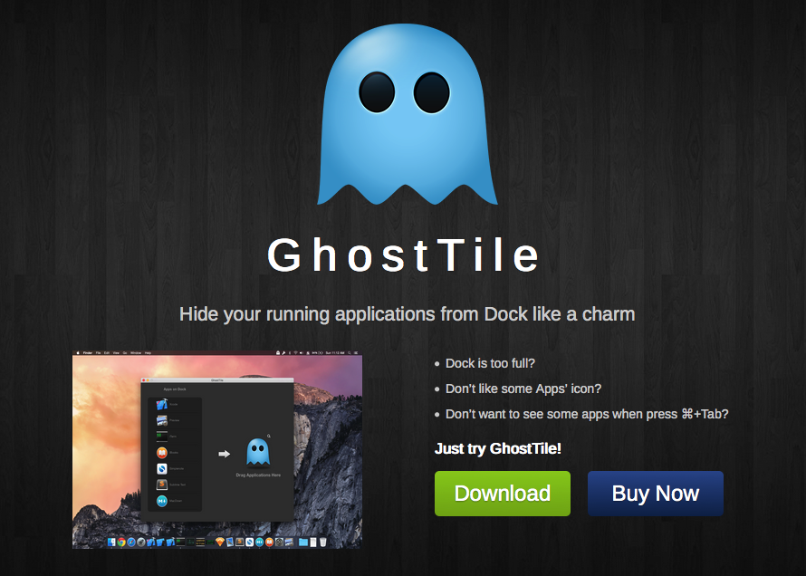
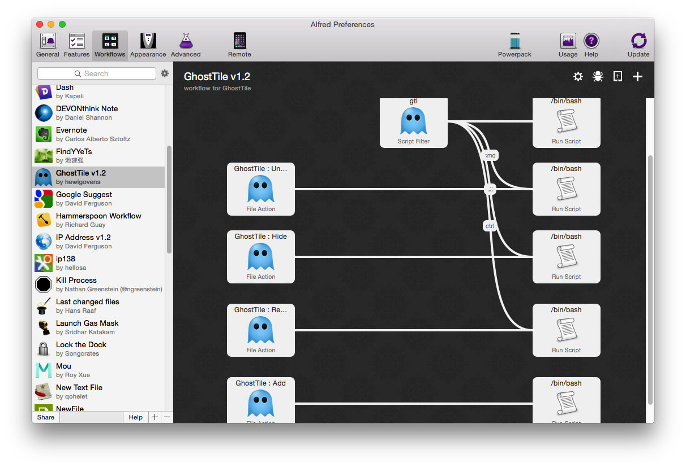
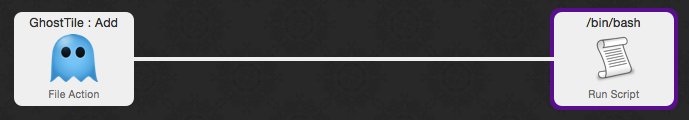
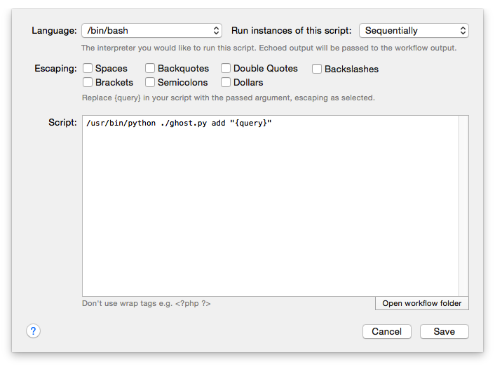
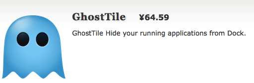

# Hammerspoon Configs

## Hammerspoon

[Download here.](http://www.hammerspoon.org)

## Usage

- Switch to certain app. `hyper` + some key
- `

## Chinese Post

[Hammerspoon](http://www.hammerspoon.org) is a desktop automation tool for OS X. It bridges various system level APIs into a Lua scripting engine, allowing you to have powerful effects on your system by writing Lua scripts.这是官网对Hammerspoon的定义。  

狭义的说它是一款可高度定制的窗口管理器，使用Lua脚本。程序员和键盘党可以按自己的需要和习惯自定义各种组合键来实现窗口的定位、移动、调节大小。广义的说它是一个自动化工具，可以扩展mac的快捷键、控制窗口大小、运行AppleScript、控制iTunes、监控wifi、地理位置等。

关于这些网上的介绍和实例有不少。[官网](http://www.hammerspoon.org/)上面有入门文档和API文档。Github上的[]()[Sample Configurations](https://github.com/Hammerspoon/hammerspoon/wiki/Sample-Configurations) 。

还有下面几个不错的博客。

[Hammerspoon, OS X 上的全能窗口管理器](https://songchenwen.github.io/tech/2015/04/02/hammerspoon-mac-window-manager/)  

[OSX 下的效率工具 Hammerspoon 和 Seil](http://blog.fengweizhou.com/2015/06/21/hammerspoon-and-seil/)  

[Mac 多显示器快速移动鼠标 ](http://www.jianshu.com/p/3d62c18c0c78)  

## 以上这些都不是今天要说的重点。

今天要说的是利用Hammerspoon的运行AppleScript功能来快速切换工作环境。这件事的起因是在V2EX上看到有人问OS X上有没有是那么软件可以快速切换工作环境。[V2EX](https://www.v2ex.com/t/203090#reply35)

> 假设同时在做多个项目，每个项目都打开了自己相关的浏览器，IDE 等，而且部分软件是全屏的。有没有一个软件可以隐藏（或最小化）其它项目的窗口，只显示当前项目的相关窗口。
> 
> 当我要做另一个项目时，我可以把相关窗口显示出来，并且全屏显示本是全屏的软件，同时隐藏之前在做的项目窗口。

有建议放在不同的桌面、切换用户、Concentrate、开多个虚拟机、买N台机器远程过去，当然也有人介绍用Hammerspoon。还有人说新版OSX有！但是还没push！这个不知道真假。

最理想的实现结果是下面这样的

> 曾经开坑写过这么软件：
> 
> 1. 一键将桌面上所有软件的状态（窗口坐标，打开的文件等）保存为一个workspace
> 2. 下次只需要选择保存过的workspace，软件会将所有软件恢复到原有状态
> 
> 后来因为开发难度太大（主要是没有统一的方法(api)去获得需要的软件信息）弃坑了....

也许新版OSX真能实现那就太好了。目前也就切换用户能跟其一拼，但是也不能实现静态保存的功能，一旦重启或者注销，那些状态也是不会保存的。这个暂且不说，其他的那些办法都不满足需求，有的不现实：比如买N台机器，有的不那么方便：比如换用户、虚拟机（虚拟机还不如多用户，资源开销太大了）、Concentrate切换只是重新打开程序，使用不同桌面的话在不同程序或者不同桌面切换的时候会混乱。比较接近需求的就是可扩展的Hammerspoon了。  

分析上面的需求：

1. 一键将桌面上所有软件的状态（窗口坐标，打开的文件等）保存为一个workspace。 --Hammerspoon可以实现把所有窗口坐标保存，可以打开指定程序，甚至可以打开指定的文件，但是不能保存当前的工作状态。
2. 选择保存过的workspace，软件会将所有软件恢复到原有状态。 --这个不能实现，利用Hammerspoon可以实现窗口的还原，工作状态无法复原。

考虑到脚本程序的限制，Hammerspoon实现WorkSpace这个功能的流程就是：

1. 设定第一个一个workspace打开的所有程序，指定一个快捷键一键打开所有程序；指定第二个快捷键保存这些指定程序的窗口状态，并且将这些程序的窗口隐藏；指定第三个快捷键恢复这些窗口；还可以加入第四个快捷键，关闭这些指定程序。
2. 定制第二个workspace，步骤同上。

这样就基本上实现快速切换workspace的功能。当然，缺点还是不少的，由于脚本语言的限制，一个workspace至少需要三个快捷键组合。

另外Hammerspoon的窗口隐藏功能，只是调用系统的hide，并不能在dock和⌘+TAB隐藏。这样在程序或者窗口切换的时候可能还是面临一大堆的窗口。要弥补这个缺陷就需要另外一个软件了[GhostTile,隐藏 Dock 上运行 App 的小工具](https://www.v2ex.com/t/107516#reply71)。



利用这个工具可以实现窗口和dock icon还有 ⌘+tab的隐藏。而且因为它自带了workflow支持，所以Hammerspoon也可以调用它的功能，如图：



可以实现Add、hide、unhide、remove，双击右边的Run Script

就看到是怎么通过脚本调用的啦，比如：



可以看到`/usr/bin/python ./ghost.py add "{query}”`是调用的`ghost.py`这个脚本。

打开这个脚本可以看到下面的内容：

``` python
#!/usr/bin/python

from AppKit import NSWorkspace
from Foundation import NSURL
import sys
import os
import plistlib

def main():

    if len(sys.argv) < 3:
        return

    action = sys.argv[1]
    the_query = sys.argv[2]

    workspace = NSWorkspace.sharedWorkspace()
    url_string = None

    if action == 'add':
        import base64
        encoded_query = base64.urlsafe_b64encode(the_query)
        print(encoded_query)
        url_string = 'ghosttile://add?app_path=%s' % encoded_query
    elif action == 'remove':
        url_string = "ghosttile://remove?bundle_id=%s" % get_bundle_id(the_query)
    elif action == 'hide':
        url_string = "ghosttile://hide?bundle_id=%s" % get_bundle_id(the_query)
    elif action == 'unhide':
        url_string = "ghosttile://unhide?bundle_id=%s" % get_bundle_id(the_query)

    url = NSURL.URLWithString_(url_string)
    print(url)
    workspace.openURL_(url)

def get_bundle_id(the_query):
    bundle_id = the_query
    if os.path.isdir(the_query):
        try:
            info_plist = the_query + "/Contents/Info.plist"
            plist = plistlib.readPlist(info_plist)
            bundle_id = plist['CFBundleIdentifier']
        except Exception, e:
            pass
    return bundle_id

if __name__ == '__main__':
    main()

```

从上面的代码很容易就能找到我们需要的内容，从命令行也可以实现了：

add:`python ghost.py add AppFullPath`

hide、unhide、remove:``python ghost.py hide bundleID`

这里需要注意的就是add的参数是app的路径和名字，其它方法的参数是`bundleID`。ghost.py可以放在任意位置，调用的时候加路径就可以了，python加不加路径就看你的系统设置了。

然后在Hammerspoon里想要调用GhostTile的功能只需要利用它的执行AppleScript功能就可以了。AppleScript就是这样写：

`do shell script "python ghost.py add AppFullPath”`

Hammerspoon执行他就是`hs.applescript.applescript(str)`这样。

app的路径和名字的这个不用讲。bundleID也可以获得`hs.application:bundleID()`

`hs.application`怎么获得呢，有几种方法:

`hs.application.launchOrFocus`Launches the app with the given name, or activates it if it's already running

`hs.application.runningApplications()`Returns all running apps.

或者先找到程序运行的窗口：

`hs.application:visibleWindows()`Returns only the app's windows that are visible.

`hs.window.visibleWindows() `Gets all visible windows

然后得到这些窗口所属的程序：

`hs.window:application()` Gets the `hs.application` object the window belongs to


啰嗦了一大堆，用了两个软件基本的需求才满足，离完美都很远。希望新版OSX真的有workspace功能，或者有人开发这么个软件。虽然功能看起来跟使用不同的用户有一些重叠。

最后说下[]()[Hammerspoon](https://github.com/Hammerspoon/hammerspoon)是开源的免费软件。[GhostTile](http://ghosttile.kernelpanic.im/)是国人编写的收费软件。比较贵。。。免费版没有功能限制，只是偶尔会弹出个提示框，平时使用没问题。但是如果你要是用workflow或者命令行调用，比如从Hammersooon中调用，那么如果正好碰上弹出提示框，那么这次调用就会失败，所以要想顺畅的使用还是需要购买一下的。

